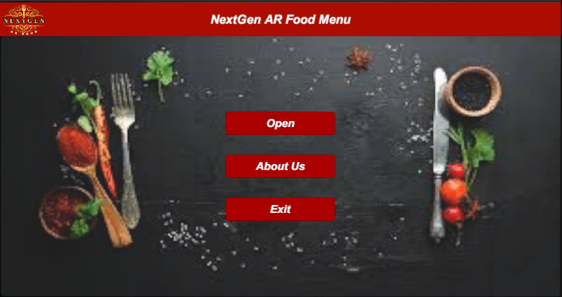
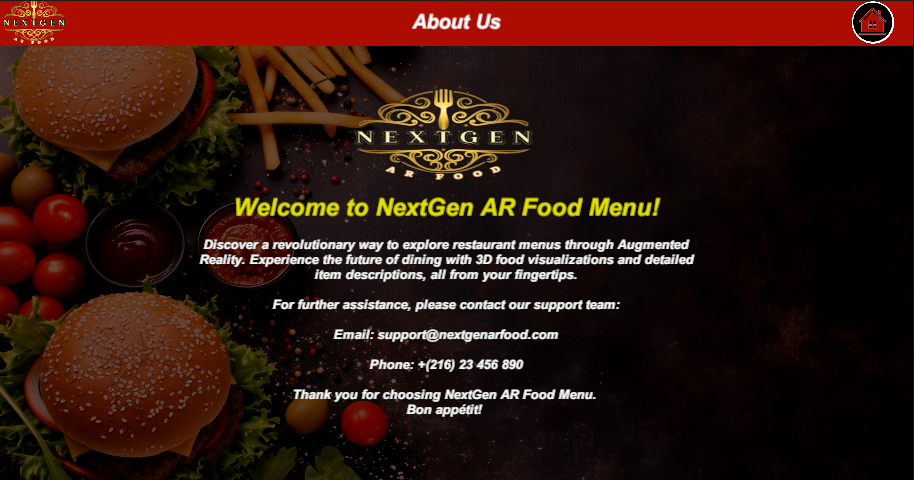
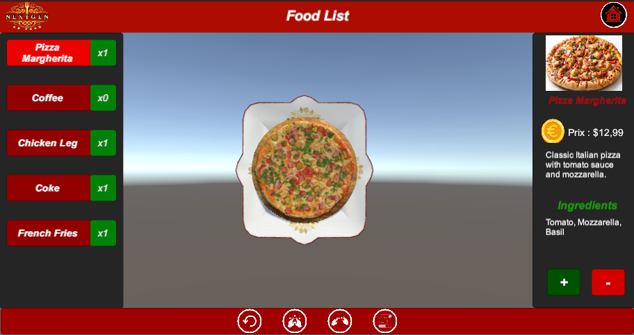
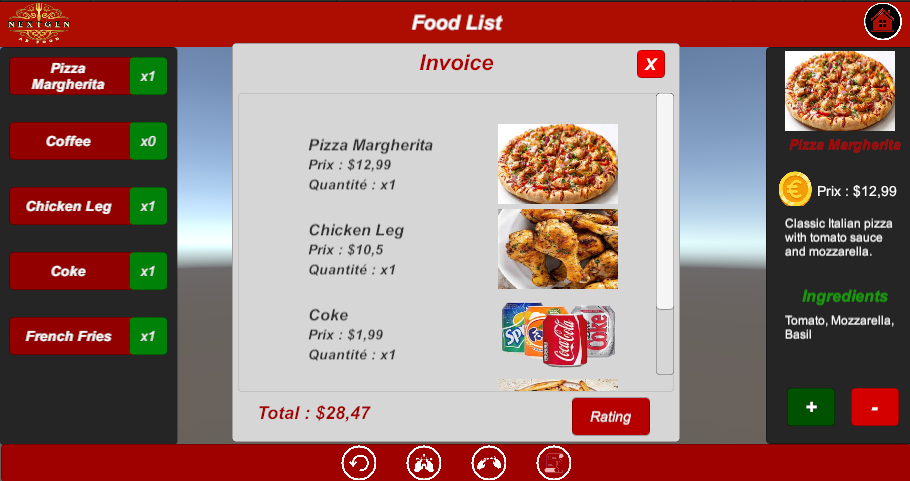
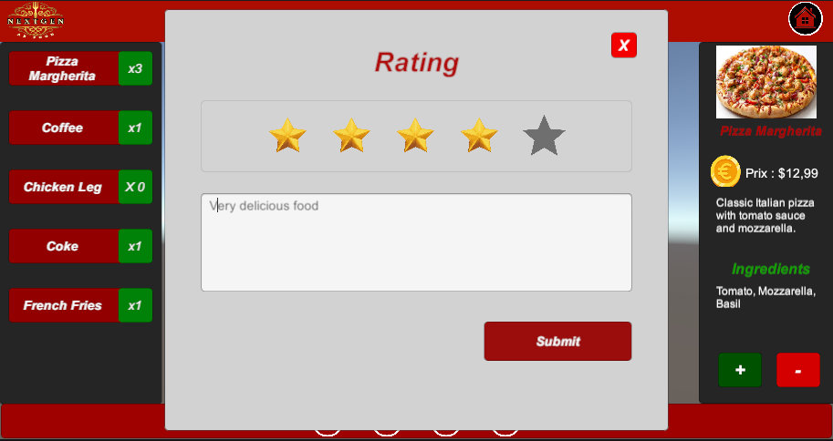
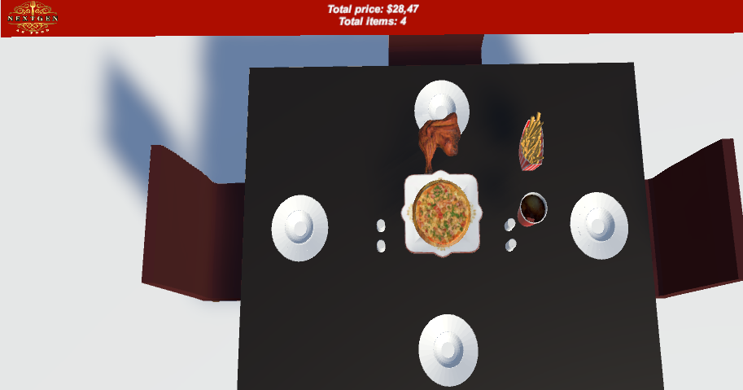

# NextGen AR Food Menu

NextGen AR Food Menu is an innovative augmented reality (AR) application developed using Unity and Vuforia. The app revolutionizes the dining experience by providing an interactive 3D food menu, enabling users to visualize dishes in AR, select and order food, view detailed invoices, rate their experience, and display purchased items in a 3D virtual restaurant environment.

---

## Features

### 1. **3D Food Menu Visualization**
- View 3D models of food items in AR.
- Rotate, zoom, and interact with realistic food representations.

### 2. **Food Selection & Ordering**
- Select food items from the menu.
- Add items to your order.
- Customize your choices (e.g., size, toppings).

### 3. **Invoice Generation**
- Detailed summary of selected items.
- Displays itemized costs, taxes, and total price.
- Download or share the invoice.

### 4. **Rating System**
- Rate your dining experience.
- Provide feedback for specific dishes or the overall experience.

### 5. **3D Restaurant Experience**
- Visualize purchased food items on a virtual dining table.
- Experience a 3D representation of the restaurant setup.

---

## How It Works

### 1. **Launch the App**
- The home screen welcomes users with options to view the menu, explore orders, and access settings.

### 2. **Scan AR Markers**
- Use your device's camera to scan AR markers for displaying 3D models of dishes.

### 3. **Place Orders**
- Add items to the cart with a simple tap.
- Customize your order based on preferences.

### 4. **View Invoice**
- After placing the order, review your invoice.
- Confirm and proceed to checkout.

### 5. **Rate Your Experience**
- Share your feedback through the built-in rating system.
- Help improve the service by leaving detailed comments.

### 6. **Enjoy the 3D Restaurant Environment**
- View your selected items on a virtual dining table for a complete AR experience.

---

## Installation

1. Clone the repository or download the project ZIP file.
2. Open the project in Unity (version 2022.3.47f1 or higher recommended).
3. Import the Vuforia Engine SDK.
4. Build and run the application on an AR-compatible device.

---

## Screenshots

### Home Screen

*Welcome screen with menu options.*

### About Page

*Information about the app and its features.*

### Food Menu

*Interactive AR-based food selection.*

### Invoice Page

*Detailed invoice summary.*

### Rating Page

*User feedback and rating interface.*

### 3D Table View

*Virtual dining experience showcasing purchased food.*

---

## Technologies Used

- **Unity**: For game development and UI design.
- **Vuforia**: For AR integration and marker tracking.
- **C#**: For scripting and logic implementation.